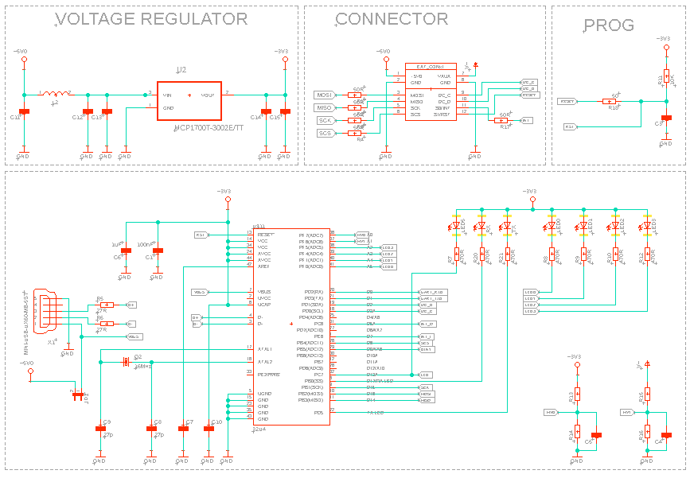
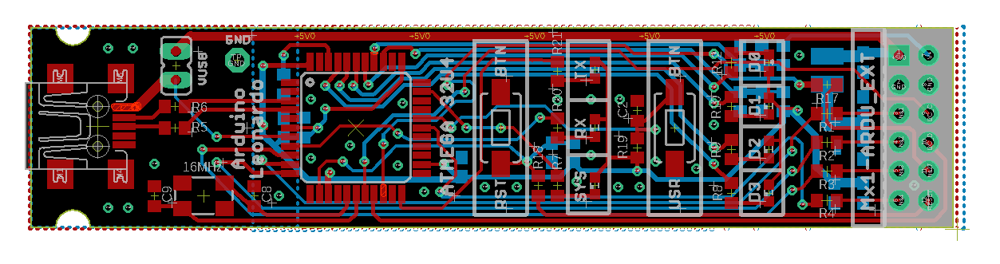
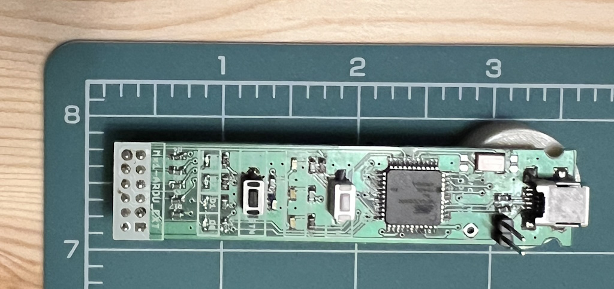
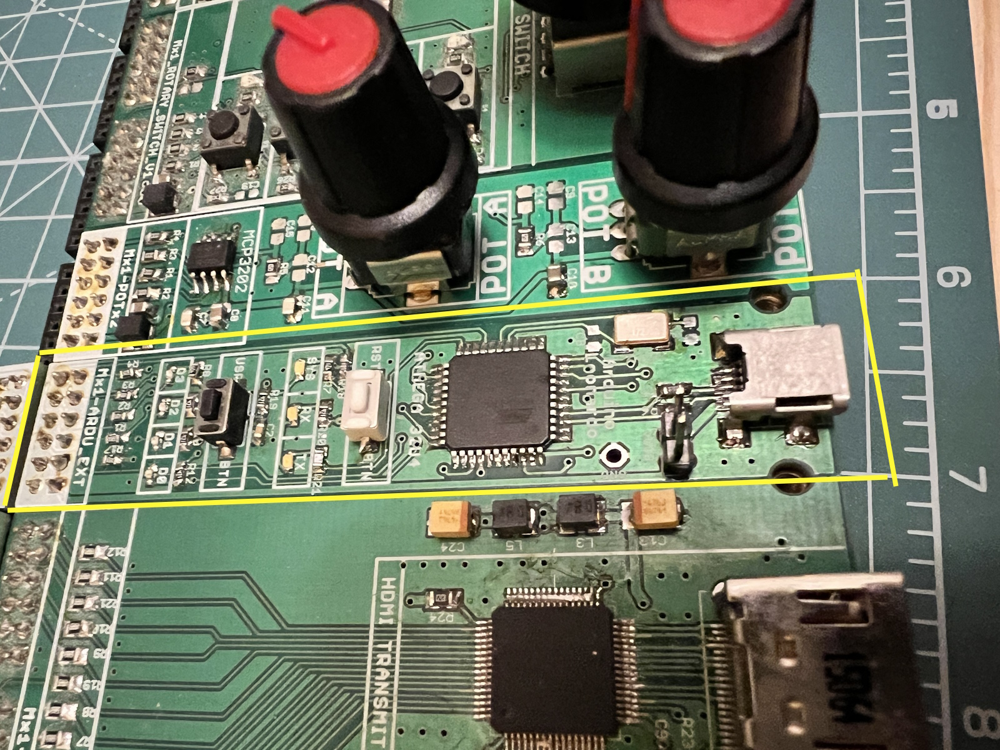
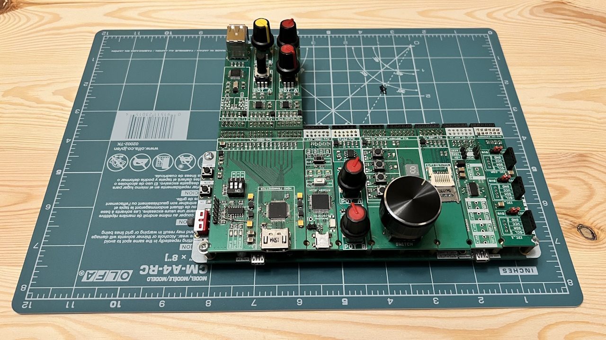

# Expansion Module: Arduino UNO

## Overview
This repository hosts the design and implementation of an expansion module that is fully compatible with Arduino UNO, utilizing a single smartboard connector. This module is specifically designed to facilitate and enhance working with FPGA systems within the smartboard ecosystem. It allows for UART connection to FPGA circuits, and I2C communication with the smartboard's socket bus, enabling easy programming and configuration of other modules requiring I2C setup. Additionally, it supports sending and receiving interrupts to/from the FPGA, streamlining high-level debugging and simplifying hardware project control loaded onto the FPGA matrix.

The module's integration with Arduino's simplicity allows for the rapid addition of software functions for debugging or configuring hardware components, such as cameras, making it an invaluable tool for accelerating and improving work with FPGA systems on smartboards. It offers an efficient way to implement high-level debugging and straightforward project control over the hardware setup.

The module is programmed via a USB port, ensuring easy and accessible firmware updates and configurations. Users are reminded to load the Arduino firmware into the module upon assembly for booting, communication, and programming purposes.

## ATmega32u4 Microcontroller

The core of this expansion module is the ATmega32u4 microcontroller, which brings the advantage of having built-in USB communication, eliminating the need for an external USB-to-serial converter. This microcontroller operates at a frequency of 16 MHz and is equipped with 32KB of flash memory, 2.5KB of SRAM, and 1KB of EEPROM. Its integrated USB functionality not only simplifies programming and communication but also enables the module to act as a USB device itself, such as a mouse, keyboard, or other HID device, opening up a plethora of possibilities for embedded projects.

Key features of the ATmega32u4 include:
- Native USB support, facilitating direct programming and communication without additional hardware.
- 23 general-purpose input/output pins (GPIO), including PWM, analog inputs, and support for I2C and SPI communication.
- Built-in hardware support for serial communication via USART, making it ideal for projects that require communication with other microcontrollers or devices.

This microcontroller's versatility and comprehensive feature set make it an excellent choice for developers looking to leverage Arduino UNO compatibility with enhanced connectivity and processing capability.

For more detailed information on the ATmega32u4 microcontroller, including technical specifications and usage guidelines, please refer to the [ATmega32u4 Datasheet](ATmega16U4-32U4-DTE.pdf) available in this repository.

## Arduino UNO Software Compatibility

This expansion module harnesses the ATmega32u4 microcontroller, ensuring software compatibility with the Arduino UNO environment. While the physical layout of the module differs from standard Arduino UNO boards, making it incompatible with Arduino shields, it retains software compatibility. This means all the digital and analog pins, UART interfaces, and other peripherals like buttons and LEDs are mapped in accordance with the Arduino UNO's configuration, facilitating seamless integration with Arduino sketches and libraries.

The module's design prioritizes integration with smartboard systems while maintaining the ease of programming and versatility associated with the Arduino software environment. Developers can utilize the familiar Arduino IDE for programming the module, taking advantage of the vast collection of libraries and tools available within the Arduino ecosystem to expedite development and prototyping processes.

Key aspects of Arduino UNO software compatibility include:
- Use of the Arduino IDE for programming, which supports direct USB programming of the ATmega32u4 without the need for an external programmer.
- Alignment with Arduino UNO's pin mapping and functionality, ensuring that existing Arduino code and libraries can be used without modification.
- Support for Arduino's standard communication protocols, allowing the module to interface with other devices and modules through UART and I2C, as well as handle interrupts, in a manner consistent with Arduino UNO projects.

This approach allows the module to blend the robust hardware capabilities of the ATmega32u4 with the user-friendly software environment of Arduino, making it ideal for a wide range of applications from educational projects to complex IoT devices.

Developers are encouraged to install the Arduino bootloader and utilize the Arduino IDE for an optimal programming experience, leveraging the compatibility to streamline development and enhance the module's functionality within the smartboard ecosystem.

## Design Documentation

Below are images showcasing various aspects of the expansion module, providing a visual overview of its design, layout, and integration capabilities:

- **Schematic Overview**
  
  This image presents the schematic diagram of the expansion module, detailing the electrical connections and components.

- **Board Design**
  
  Here is the physical layout of the PCB, showing the placement of components and the overall design of the board.

- **Module Size and Dimensions**
  
  This picture illustrates the module's dimensions and size, providing a clear view of its compactness and how it fits within a smartboard system.

- **Integration with Smartboard and Arduino UNO**
  
  A visual representation of how the module integrates with a smartboard, including an example setup featuring an Arduino UNO.

- **Smartboard System Example**
  
  An example of a smartboard system fully equipped with several expansion modules, demonstrating the modular nature and versatility of the smartboard ecosystem.

These images collectively offer a comprehensive view of the expansion module's design, functionality, and integration potential within smartboard projects.

## Contributions and Feedback
Contributions to this project are welcome. If you have suggestions for improvement or have developed additional features, please fork the repository, make your changes, and submit a pull request. For any questions or issues, please open an issue in the GitHub repository.

## License
This project is licensed under the MIT License with the following terms:

- **Permission to Use**: You are free to use, modify, and distribute this design in both private and commercial settings.
- **Attribution Requirement**: While not required, attribution to the original author, Adam Łuczak, is appreciated. This can be done through a citation or a link back to this repository.
- **No Warranty**: This design is provided "as is", without warranty of any kind. Use it at your own risk.
- **Liability**: The author is not liable for any damages or losses that may arise from the use of this design.

For the full terms and conditions, please refer to the MIT License documentation.

## Contact
Should you have any inquiries or suggestions regarding this project, please don't hesitate to contact Adam Łuczak at adam.luczak@outlook.com.
